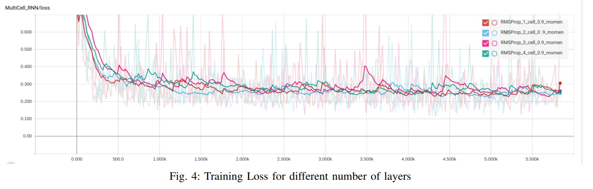

This package contains work completed during my research internship at Indian Institute of Technology, Kanpur.
Tensorflow library was used along with ROS and MoveIt! package to mimic an RRT motion planner using a Deep Recurrent Neural Network.
The input passed to the network consists of the goal, and joint angles(t) and it is trained against labels of joint angles(t+1) with synthetic datasets generated from a script which randomly places feasible goals for a UR5 simulated robot running in the Gazebo simulator using an RRT path planner from the MoveIt! package.

Report: https://drive.google.com/file/d/1Rkf6Qb2YONkkqD4pKJyYoBoICHxpD8P3/view?usp=sharing
